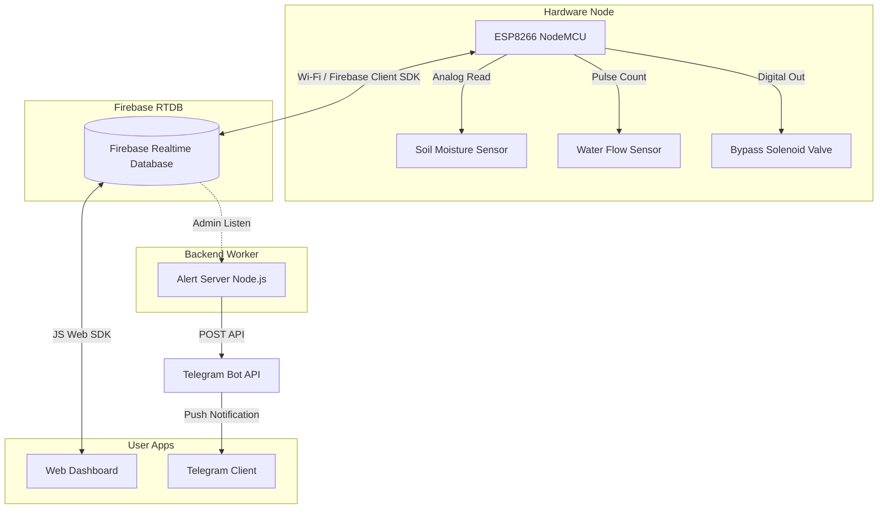

# Smart Sprinkler System 🌾💧


The **Smart Sprinkler System** is an IoT-based precision irrigation platform designed to optimize agricultural water management. By integrating an **ESP8266 microcontroller**, soil moisture and water flow sensors, a **Firebase Realtime Database**, a responsive web dashboard, and a **Telegram Alert Server**, this system transitions conventional "blind" irrigation into intelligent, data-driven watering. 

Unlike traditional sprinkler systems that run continuously or on rigid timers, this system calculates exact crop water requirements in real time, automates irrigation cycles, monitors water flow to detect clogs or leaks, and automatically executes self-cleaning procedures when issues arise.

---

## Table of Contents
- [System Architecture](#system-architecture)
- [Repository Structure & Separation of Concerns](#repository-structure--separation-of-concerns)
- [Features Reference](#features-reference)
- [Future Enhancements](#future-enhancements)
- [Hardware & Wiring Guide](#hardware--wiring-guide)
- [Arduino IDE Configuration & Flashing](#arduino-ide-configuration--flashing)
- [Web Dashboard Setup](#web-dashboard-setup)
- [Telegram Notification System Setup](#telegram-notification-system-setup)
  - [Overview & Implemented Alerts](#overview--implemented-alerts)
  - [1. Creating the Telegram Bot](#1-creating-the-telegram-bot)
  - [2. Retrieving Your Chat ID](#2-retrieving-your-chat-id)
  - [3. Dashboard Integration](#3-dashboard-integration)
  - [4. Deploying the Alert Server (Railway)](#4-deploying-the-alert-server-railway)
  - [5. Testing & Troubleshooting](#5-testing--troubleshooting)
- [Security Guidelines](#security-guidelines)

---

## System Architecture

The Smart Sprinkler System is comprised of edge nodes, a cloud database, an interactive client control panel, and a background notifier working in unison.



---

## Repository Structure & Separation of Concerns

This project is divided into two distinct repositories to guarantee stability and prevent resource contention:

### 1. Main Repository (This Repo)
Responsible for edge logic, the database config, and user interactions.
*   **`SprinklerEspCode/`**: C++ firmware for the ESP8266. Handles sensor data acquisition, irrigation calculations, offline state heartbeat, self-cleaning bypass valve control, and safety halt routines.
*   **`public/`**: Frontend web dashboard built with HTML, CSS (featuring modern glassmorphism design), and Vanilla JS. Interfaces directly with the Firebase Web SDK to provide real-time control, analytics, user profile setups, and threshold configurations.

### 2. Alert Server Repository ([SprinklerAlert](https://github.com/LOGITHP/SprinklerAlert.git))
A lightweight, dedicated backend application built using Node.js.
*   **Purpose**: Continuously monitors the Firebase database 24/7. It tracks if devices go offline (using a heartbeat mechanism) and checks for critical diagnostic messages.
*   **Why Separate?**: Static web hosts cannot maintain long-lived listener sockets to Firebase or run background logic 24/7 without a client tab remaining open. The backend server isolates these computational listener duties and communicates directly with the Telegram Bot API to send push notifications.

---

## Features Reference

### Implemented ESP8266 Firmware Features
*   **Telemetry Sampling**: Aggregates readings into rolling arrays to calculate moving averages:
    *   *Soil Moisture*: Calculated as an average of 15 analog samples.
    *   *Water Flow*: Monitored via interrupts, calculating a short-term average (5 seconds) and a long-term reference average (45 seconds).
*   **Deficit-Based Irrigation Math**: Calculates precise irrigation durations based on soil moisture levels, crop root depth, and specific soil properties to optimize water consumption.
*   **Multi-Attempt Irrigation Loop**: Automatically runs up to 4 irrigation cycles. If target moisture is not met after 4 attempts, the system halts with a `Failed: Target not reached` state.
*   **Blockage Detection & Self-Cleaning**: If the short-term flow drops below 80% of the calibrated reference flow for 15 seconds, the system activates a bypass solenoid valve (`CLEAN_VALVE`) for 5 seconds to flush sediments and debris.
*   **Safety Halt Routines**: Stops irrigation and flags statuses to the database to prevent pump burn or flooding:
    *   `Halted: No Flow Detected` (When flow rate falls below 0.3 L/min during active irrigation).
    *   `Halted: Clog Not Rectified` (When flow remains low after 4 self-cleaning attempts).
    *   `Halted: Overflow` (When flow rate exceeds the reference flow by 20% for 30 consecutive seconds).
*   **EEPROM Parameter Cache**: Stores target moisture, root depth, field capacity, and wilting point configurations in local EEPROM so the device retains settings across power cycles.
*   **Over-The-Air (OTA) Updates**: Serves an update portal locally on port 80 via `ElegantOTA` allowing seamless web-based firmware flashes. Firebase listeners are gracefully suspended during OTA updates to maximize heap memory availability.

### Implemented Web Dashboard Features
*   **Glassmorphic Responsive Interface**: Modern design equipped with micro-animations, color-coded health states, dynamic charts, and custom interactive cursors.
*   **Dynamic Authentication & Onboarding**: Fully featured Sign-Up/Login screen integrated with Firebase Auth. Displays an onboarding flow on first-login to help register new Sprinkler IDs.
*   **Plant Preset Library**: Dropdown selection with preset profiles for major crops:
    *   *Wheat, Maize, Groundnut, Sunflower, Potato, Tomato, Onion, Carrot, Cabbage, and Napier Grass*.
    *   Automatically populates root depth, field capacity, wilting point, and moisture threshold settings based on the crop and soil type (Loamy, Sandy, Clay, Sandy Loam).
*   **Interactive Control Panel**:
    *   *Auto Mode*: ESP8266 automates irrigation based on sensor readings and crop configuration.
    *   *Manual Mode*: Enables direct remote control to turn the motor ON/OFF.
*   **Real-time Analytics**: Displays live calculated metrics including Average Moisture, Average Flow Rate (L/min), Active Operation Time, Cumulative Water Consumption (Liters), and System Health banners.
*   **Diagnostic Logging**: Renders an interactive table showing the 15 latest diagnostic event logs pulled from the database history node.
*   **OTA Controller**: Detects active local IP addresses of devices and renders links to their local OTA update portals.

---

## Future Enhancements
*   **Actuator Drive Hardware Integration**: Physical motor/pump control pin driver implementation (disabled in current firmware iteration to prevent accidental flooding during simulation).
*   **Weather API Integration**: Fetching local weather forecasts to skip scheduled watering if rain is predicted.
*   **Wind-Speed Based Control**: Adjusting spray patterns or pausing irrigation during high winds to minimize water drift (Wind Direction UI is prepared but not bound).
*   **Machine Learning Schedules**: AI models predicting soil dry-out rates using historical moisture telemetry.

---

## Hardware & Wiring Guide

| Sensor / Actuator | ESP8266 NodeMCU Pin | Pin Type | Notes |
| :--- | :--- | :--- | :--- |
| **YF-S201 Flow Sensor** | `GPIO14 (D5)` | Digital Input (Pullup) | Uses hardware interrupts to measure pulse counts. |
| **Soil Moisture Sensor** | `A0` | Analog Input | Measures relative moisture via voltage divider. |
| **Bypass Solenoid Valve**| `GPIO12 (D6)` | Digital Output | Triggered HIGH to activate the self-cleaning cycle. |
| **Water Pump Relay** | *GPIO13 (D7)* *(Optional)* | Digital Output | Optional configuration for physical motor drive. |

---

## Arduino IDE Configuration & Flashing

### 1. Board Package Installation
1.  Open Arduino IDE, go to **File > Preferences**.
2.  Add the following URL to **Additional Boards Manager URLs**:
    `http://arduino.esp8266.com/stable/package_esp8266com_index.json`
3.  Navigate to **Tools > Board > Boards Manager**, search for `esp8266` and click **Install**.

### 2. Required Libraries
Install the following libraries through the Library Manager (**Tools > Manage Libraries**):
*   **Firebase ESP Client** (by *Mobizt* - Version 4.x.x)
*   **ElegantOTA** (by *Ayush Sharma* - Version 2.x.x)
*   *Note: Built-in libraries `ESP8266WiFi`, `ESP8266WebServer`, and `EEPROM` are resolved automatically by the board manager.*

### 3. Firmware Configuration
Open `SprinklerEspCode/SprinklerEspCode.ino` and modify the configuration fields:
```cpp
// Wi-Fi Config
#define WIFI_SSID "YOUR_WIFI_NAME"
#define WIFI_PASS "YOUR_WIFI_PASSWORD"

// Firebase Config (Retrieved from Firebase Console)
#define API_KEY "AIzaSy..."
#define DATABASE_URL "https://your-project-default-rtdb.firebaseio.com"

// User login credentials (must match dashboard signup credentials)
#define USER_EMAIL "farmer1@gmail.com"
#define USER_PASSWORD "123456"

// Sprinkler ID (Generated in onboarding or dashboard profile modal)
#define SPRINKLER_ID "Sprinkler-1"
```

### 4. Flashing instructions
1. Connect the ESP8266 board to your PC.
2. Select your device port in **Tools > Port**.
3. Select board model: **NodeMCU 1.0 (ESP-12E Module)**.
4. Click the **Upload** button.

---

## Web Dashboard Setup

1.  **Clone this repository** to your local drive.
2.  **Create a Firebase Project** in the [Firebase Console](https://console.firebase.google.com/).
3.  Enable **Authentication** and activate the **Email/Password** sign-in provider.
4.  Enable **Realtime Database** (choose a location close to your site).
5.  Update the database security rules in the console (or upload `database.rules.json`):
    ```json
    {
      "rules": {
        ".read": true,
        ".write": true
      }
    }
    ```
6.  Navigate to **Project Settings** on Firebase, create a new Web Application, and copy the config block.
7.  Open `public/app.js` and paste your project config details inside the `firebaseConfig` constant:
    ```javascript
    const firebaseConfig = {
        apiKey: "YOUR_API_KEY",
        authDomain: "YOUR_PROJECT_ID.firebaseapp.com",
        databaseURL: "https://YOUR_PROJECT_ID-default-rtdb.firebaseio.com",
        projectId: "YOUR_PROJECT_ID",
        storageBucket: "YOUR_PROJECT_ID.firebasestorage.app",
        messagingSenderId: "YOUR_MESSAGING_SENDER_ID",
        appId: "YOUR_APP_ID"
    };
    ```
8.  Host the folder using a local server (e.g., Live Server extension in VS Code) or deploy to static platforms such as Firebase Hosting or Vercel.

---

## Telegram Notification System Setup

### Overview & Implemented Alerts
Telegram alerts keep you updated on the operational state of your fields. The alert server evaluates conditions and pushes messages to the Telegram Bot API:

*   **Low Flow Warning**: Sent if flow rates drop during watering cycles.
*   **System Halts**: Immediate alerts for `No Flow Detected`, `Clog Not Rectified`, and `Overflow`.
*   **Watering Status**: Alerts if target moisture was not met within 4 execution cycles.
*   **Offline Heartbeats**: A critical message is pushed if any sprinkler node disconnects or stops writing to the database for over 15 seconds.

```
🚨 SMART IRRIGATION ALERT

⚠ Sprinkler-1: Clog detected at • 1 offline (Sprinkler-1)
```

---

### 1. Creating the Telegram Bot
1.  Open the Telegram app and search for the official account **`@BotFather`**.
2.  Start a chat and send the command:
    ```text
    /newbot
    ```
3.  Enter a display name for your bot (e.g., `Smart Sprinkler Alerts`).
4.  Specify a unique username. The username **must** end with the word `bot` (e.g., `my_smart_sprinkler_bot`).
5.  Copy the generated **API Token** (e.g., `1234567890:AAExampleBotToken...`). Keep this token completely private.

---

### 2. Retrieving Your Chat ID
You must obtain your numeric Telegram Chat ID to tell the bot where to send notifications.

#### Method 1: Using Info Bots (Easiest)
1.  Search for **`@userinfobot`** or **`@RawDataBot`** on Telegram.
2.  Press **Start**.
3.  Copy the numeric value listed under `Id` (e.g., `7759053859`).

#### Method 2: Manually polling the Bot API
1.  Open your newly created bot in Telegram and press the **Start** button.
2.  Send any test message to the bot (e.g., "Hello").
3.  Open a web browser and visit:
    `https://api.telegram.org/bot<YOUR_BOT_TOKEN>/getUpdates` *(replace `<YOUR_BOT_TOKEN>` with your token)*.
4.  Locate the JSON object block `"chat"` -> `"id"` and copy that number.

---

### 3. Dashboard Integration
1.  Log in to your hosted **Web Dashboard**.
2.  Click the user profile icon (your initials) at the top-right corner to open the profile slide-out panel.
3.  Locate the **Telegram Alerts** configuration section.
4.  Paste your **Bot Token** and **Chat ID**.
5.  Click **Save Alerts Config**. These parameters are written to the database under `users/{uid}/config/telegram` and dynamically fetched by the alert server.

---

### 4. Deploying the Alert Server (Railway)

The alert server runs in the cloud to process events 24/7.

1.  Create a free account at [Railway.app](https://railway.app/).
2.  Click **New Project > Deploy from GitHub**.
3.  Grant authorization to GitHub and select the Alert Server repository:
    `https://github.com/LOGITHP/SprinklerAlert`
4.  Navigate to the project settings on Railway, select the **Variables** tab, and configure:
    *   `USER_EMAIL`: The Firebase login email of the farmer (e.g., `farmer1@gmail.com`).
    *   `USER_PASSWORD`: The corresponding password (e.g., `123456`).
    *   *Note: The Firebase Project config is baked into the server source, while variables handle authentication dynamically.*
5.  Click **Deploy**.
6.  Verify deployment status: Check the logs in the Railway console. You should see:
    ```text
    🌐 Web server is listening on port 3000
    ✅ Logged into Firebase successfully as: farmer1@gmail.com
    ✅ Telegram Config Loaded!
       - Chat ID: 7759053859
    👀 Listening for sprinkler issues...
    ```

---

### 5. Testing & Troubleshooting

#### How to run a test
1.  Verify the alert server is running successfully on Railway.
2.  Ensure your Telegram Bot has been started (press `/start` inside the bot conversation).
3.  Trigger an offline alert by unplugging your ESP8266 module.
4.  Wait 15 seconds. The alert server will detect the missing heartbeat and push an offline warning to your Telegram account.

#### Common Troubleshooting Steps
*   **Bot does not send alerts**: Make sure you have opened a chat with your bot on Telegram and clicked the **Start** button. The bot cannot message users who haven't initiated contact.
*   **Incorrect Chat ID**: Chat IDs are purely numerical. Do not include usernames or letters.
*   **Railway deployment fails**: Verify that `USER_EMAIL` and `USER_PASSWORD` are configured exactly as they appear in your Firebase Authentication database.
*   **Firebase Authentication issues**: Confirm your project has dynamic security rules enabling reading/writing or that rules do not block the IP address range of the server host.
*   **Alert spamming prevention**: The alert server has a built-in cooldown window of 5 minutes (300,000 ms) for the same recurring status to prevent flooding your Telegram account.

---

## Security Guidelines

*   **Secrets Storage**: Never embed your Telegram Bot API Token or Firebase project Admin Keys in the source files. Always use Railway environment variables or read them dynamically from secured database nodes.

*   **Database Constraints**: Once testing is complete, restrict access permissions in Firebase Database rules to authenticated UIDs to prevent data tampering.

---

## Intellectual Property & Patent Status

> [!IMPORTANT]
> **Patent Pending Product**
> This Smart Sprinkler System, including its dynamic telemetry-driven irrigation calculation logic, integrated blockage detection algorithms, and automated self-cleaning mechanisms, is a patent-pending product. 
> 
> Unauthorized copying, cloning, distribution, or commercial exploitation of this repository or its constituent components is strictly prohibited. All rights reserved.